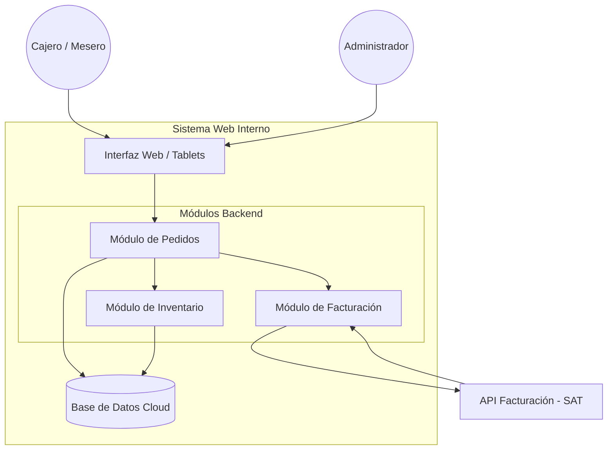

# RODFOOD - Sistema de Gestión de Restaurante

##  Descripción del Proyecto
Este proyecto es un **Sistema Web Interno** desarrollado para la empresa **RODFOOD**. Su objetivo es digitalizar y automatizar los procesos críticos de gestión que actualmente se realizan de forma manual. 

El sistema aborda las siguientes problemáticas:   
**Pedidos Manuales:** Eliminación de errores en órdenes y comandas en papel.
**Inventario Desactualizado:** Control de stock y mermas en tiempo real.
**Facturación Lenta:** Automatización de emisión de CFDI y reportes contables.

##  Arquitectura del Sistema
El proyecto está diseñado para ser desplegado en la nube, dado que la empresa no cuenta con infraestructura de servidores propia.

* **Frontend:** HTML5, CSS3 (Bootstrap), JavaScript (Diseño responsivo para Tablets/Cajeros).
* **Backend:** Java (Spring Boot).
* **Base de Datos:** MySQL/PostgreSQL (Cloud Hosted).
* **Facturación:** Integración con API de PAC autorizado.
* **CI/CD:** Travis CI (Pruebas unitarias con JUnit).

##  Módulos y Funcionalidades
El desarrollo se divide en dos etapas de madurez (Milestones):

### 1. Etapa BETA (Core Development)
Enfoque en la operación diaria interna.
* **Módulo de Pedidos:** Interfaz para cajeros, creación de órdenes y notificación a cocina.
* **Módulo de Inventario:** Registro de insumos y descuento automático de stock al vender.
* **Seguridad:** Autenticación de empleados y respaldos diarios de base de datos.

### 2. Etapa GA (General Availability)
Enfoque en administración y fiscalización.
* **Módulo de Facturación:** Generación de facturas electrónicas y conexión con API externa.
* **Reportes:** Exportación de datos a Excel y alertas de stock mínimo.
  
##  Configuración

El sistema utiliza el estándar de Spring Boot. El archivo principal se encuentra en:
`demo/src/main/resources/application.properties`

### Archivos de Configuración
Actualmente, el proyecto está configurado para un entorno de desarrollo local.
* **Puerto del Servidor:** 8080 (Por defecto).
* **Base de Datos:** H2 (Memoria) o MySQL (según perfil activo).

### Variables de Entorno (Requeridas para Producción)
Por seguridad, no guardamos contraseñas en el código. Para desplegar en la nube, debes configurar estas variables en tu servidor:

| Variable | Descripción | Ejemplo |
| :--- | :--- | :--- |
| `SPRING_DATASOURCE_URL` | URL de conexión JDBC | `jdbc:mysql://cloud-db:3306/rodfood` |
| `SPRING_DATASOURCE_USERNAME` | Usuario de la BD | `admin_rodfood` |
| `SPRING_DATASOURCE_PASSWORD` | Contraseña de la BD | `secret123` |

---
##  Manual de Uso

### Perfil: Cajero (Tablet)
El módulo de pedidos está diseñado para uso táctil.
1.  **Iniciar Turno:** Ingresar con usuario y contraseña en la pantalla de Login.
2.  **Crear Orden:**
    * Ir a la pestaña **"Nueva Comanda"**.
    * Seleccionar los platillos tocando las imágenes (ej. "Hamburguesa Doble").
    * Agregar notas personalizadas (ej. "Sin cebolla") en el botón de edición.
3.  **Enviar a Cocina:** Presionar el botón verde **"Confirmar Pedido"**. Esto descuenta automáticamente los ingredientes del inventario.
4.  **Cobrar:** En la vista "Mesas Activas", seleccionar la mesa y dar clic en **"Cerrar Cuenta"** para generar el ticket.

### Perfil: Administrador (Web PC)
1.  **Gestión de Menú:**
    * Ir a **"Catálogo > Platillos"**.
    * Usar el botón "Agregar Nuevo" para definir nombre, precio y receta.
2.  **Reportes:**
    * En el **Dashboard**, visualizar la gráfica de "Ventas vs Insumos" para detectar mermas.
    * Descargar el reporte de cierre de día en formato Excel.

---


##  Instalación y Configuración Local

1.  **Clonar el repositorio:**
    ```bash
    git clone [https://github.com/Luishdz02/RODFOOD-System.git](https://github.com/Luishdz02/RODFOOD-System.git)
    cd RODFOOD-System
    ```

2.  **Configuración de Base de Datos:**


3.  **Ejecutar la aplicación:**
    ```bash
    ./mvnw spring-boot:run
    ```

4.  **Ejecutar Pruebas (JUnit):**
    ```bash
    ./mvnw test
    ```

##  Flujo de Trabajo (Gitflow)
Este proyecto sigue una estrategia de ramas estricta:

* `master`: Código de producción (GA). Solo acepta Pull Requests desde `develop`.
* `develop`: Rama principal de integración (BETA).
* `feature/nombre-tarea`: Ramas para cada requerimiento específico (ej. `feature/login-usuario`).
  

##  Guía de Contribución

Este proyecto sigue estrictamente la metodología **Gitflow**. Si deseas colaborar, sigue estos pasos:

git clone [https://github.com/Luishdz02/RODFOOD.git](https://github.com/Luishdz02/RODFOOD.git)
cd RODFOOD
git checkout develop



##  Autor
**Luis Alberto Hernández Avilés** 
* Matrícula: 07098514
* Curso: Taller de Productividad basada en herramientas tecnológicas.
* Tecmilenio 

---
*Este proyecto es parte de una actividad académica con fines de implementación real bajo consentimiento de la empresa RODFOOD*
